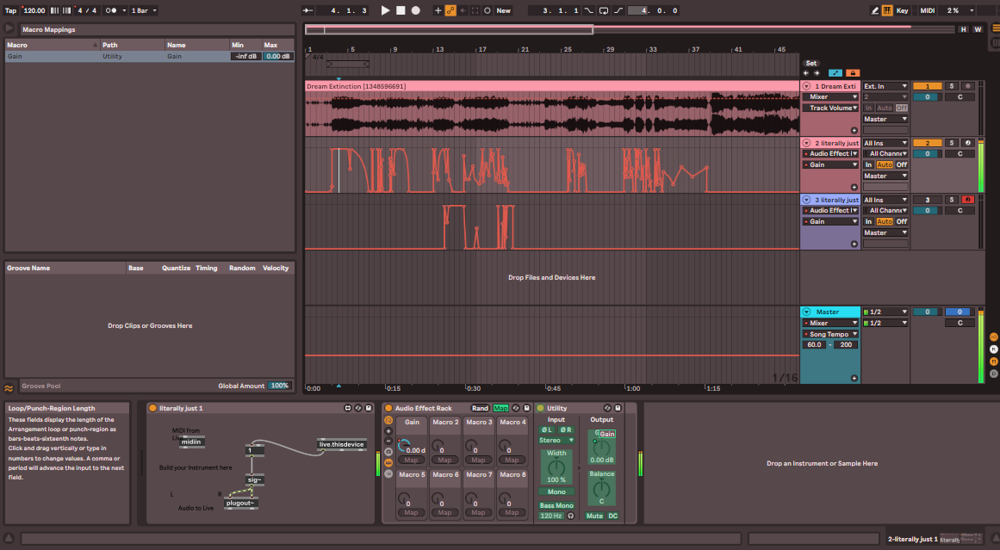
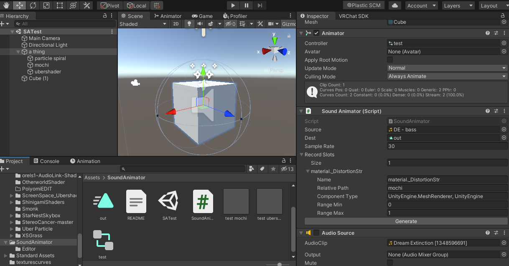
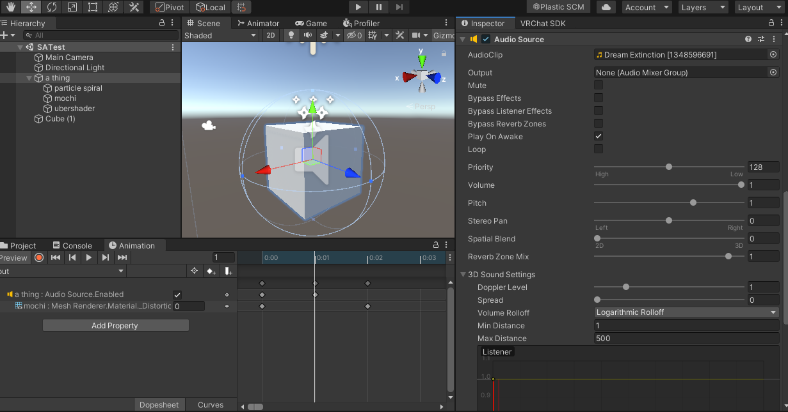

# How to use

First, make an audio file where the DC offset is automated to how you want a Unity param to move. In ableton, I did this with the "literally just 1" amxd in the repository (that's what it outputs) and a utility where the gain is automated between -inf and 0 dB:

Solo the track, export, move it to unity, add the SoundAnimator component, put the audio in, and fill out the parameters:

- Dest should be an animation where you want the parameters you enter to be overwritten (the other params in the animation will be left alone)
- Source should be your DC offset audio file
- Sample Rate should probably be 30, 60 if you want ultra high quality (idk if it goes higher)
- Name should be the name of the parameter on your component
- Component Type should be an argument that can be understood by [System.Type.GetType](https://forum.unity.com/threads/using-type-gettype-with-unity-objects.136580/) that selects the component you want.

To sync the audio disable the component on the first keyframe, and enable it on the second after 1/60th of a second (idk why lol)

